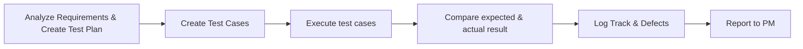

## Functional Test

### <u>**Functional Test**</u>
is a process of testing on specific functions or features of a software.
An example of QA Super is ascertaining whether users can log in smoothly without any obstacles. 
Especially, inputting **usernames** and **passwords** and clicking the **login button** should never be an issue.

##### Functional Testing involves checking of the following:
- User Interface
- APIs

### <u>**Goal:**</u>
Normally, we make sure or check the primary entry function, necessarily usable function, the flow of screen GUI. Functional testing shows the error message so that the user can easily navigate throughout the application.

**[⬆ back to top](#functional-test)**

## Functional test stages

